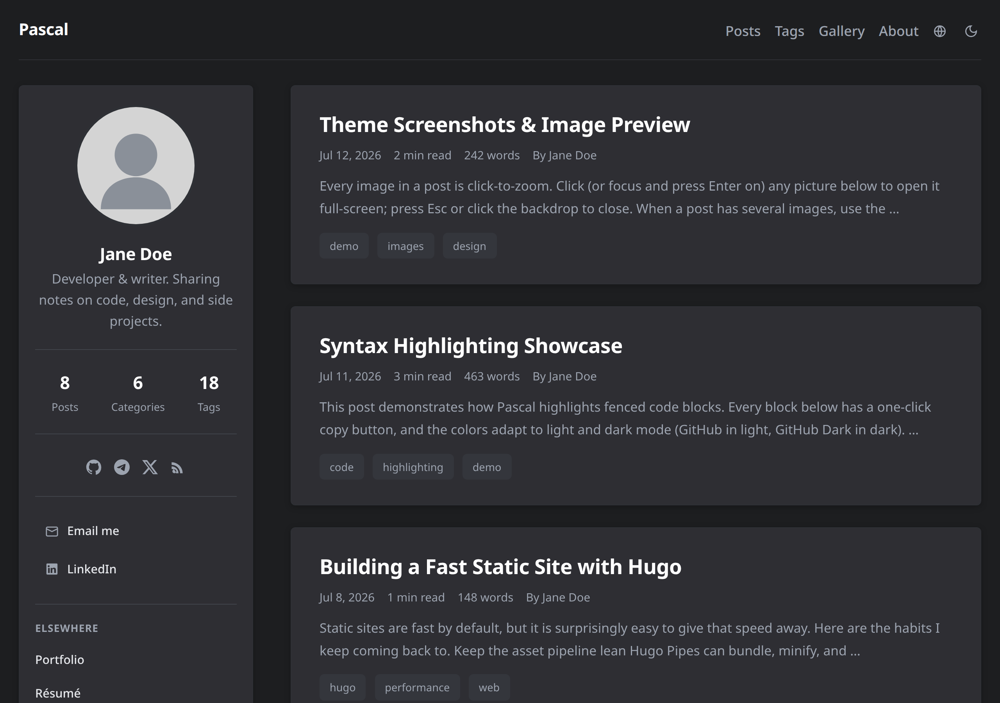

# Beacon

[](https://github.com/STARRY-S/hugo-theme-beacon/actions/workflows/build.yml)

[](LICENSE)

A clean, fast [Hugo](https://gohugo.io/) theme for personal blogs, technical writing, photography, and long-form archives.

[Live demo](https://beacon-demo.starry-s.moe/) · [Getting started](docs/getting-started.md) · [Configuration](docs/configuration.md) · [Feature guides](docs/features.md) · [Deployment](docs/deployment.md)



## Highlights

- Editorial post lists and a focused 760px reading layout
- Auto, Light, and Dark themes with system preference tracking
- Responsive images, Gallery timelines, EXIF details, and an accessible lightbox
- Optional sidebar, Profile homepage, comments, Sponsor cards, math, and music
- English, Simplified Chinese, Traditional Chinese, and Japanese UI translations
- Pagination-aware SEO metadata, JSON-LD, hreflang, RSS, robots, and sitemap output
- Keyboard-friendly navigation, drawers, disclosures, copy controls, and reduced-motion support

Optional third-party features are disabled until configured and load only on pages that need them.

## Requirements

| Tool | Version | Why |
| --- | --- | --- |
| Hugo extended | 0.155.3 or newer | Site generation and image processing |
| Dart Sass | 1.102.0 | Compiles the theme's SCSS modules |
| Node.js | 24 when using npm | Installs pinned Sass in CI; required by repository tests |

See [Getting started](docs/getting-started.md#requirements) for installation notes.

## Quick start

```bash
hugo new site my-blog
cd my-blog
git init
git submodule add https://github.com/STARRY-S/hugo-theme-beacon.git themes/beacon
cp themes/beacon/hugo.example.toml hugo.toml
hugo new content posts/hello/index.md
hugo server -D
```

Open `http://localhost:1313/`. The starter configuration is intentionally small and does not enable comments, music, Iconify, Sponsor providers, or external accounts.

Do not copy `exampleSite/` into a new blog. It is a multilingual feature demo with third-party integrations and visibly fake payment data.

## Basic content

A post can start with ordinary Hugo front matter:

```yaml
---
title: "Hello, Beacon"
date: 2026-09-01T10:00:00+08:00
tags: [Hugo, Notes]
draft: false
---

Write with Markdown as usual.
```

Keep post images in the same leaf bundle when you want responsive processing and full intrinsic dimensions:

```text
content/posts/hello/
├── index.md
└── cover.jpg
```

## Documentation

| Guide | Covers |
| --- | --- |
| [Getting started](docs/getting-started.md) | Installation, updates, content layout, local preview, troubleshooting |
| [Configuration](docs/configuration.md) | Site parameters, page front matter, menus, sidebar, Profile mode, indexing |
| [Feature guides](docs/features.md) | Images, Gallery, comments, Sponsor, music, math, multilingual sites, customization |
| [Deployment](docs/deployment.md) | Production builds, static hosting, GitHub Pages, image cache guidance |
| [Contributing](CONTRIBUTING.md) | Locked development toolchain and test commands |
| [Architecture](docs/architecture.md) | Maintainer-facing design and compatibility constraints |

The complete safe starter is [hugo.example.toml](hugo.example.toml). The more extensive [exampleSite/hugo.toml](exampleSite/hugo.toml) is useful as a feature reference, not as a starter.

## Updating

From your site repository:

```bash
git submodule update --remote themes/beacon
git add themes/beacon
git commit -m "chore: update Beacon"
```

Review changes and build locally before publishing, especially when your site overrides theme layouts or SCSS.

## Contributing

Bug reports and focused pull requests are welcome. Read [CONTRIBUTING.md](CONTRIBUTING.md) before changing layouts, URL handling, optional integrations, or accessibility behavior.

## License

Beacon is available under the [MIT License](LICENSE).
